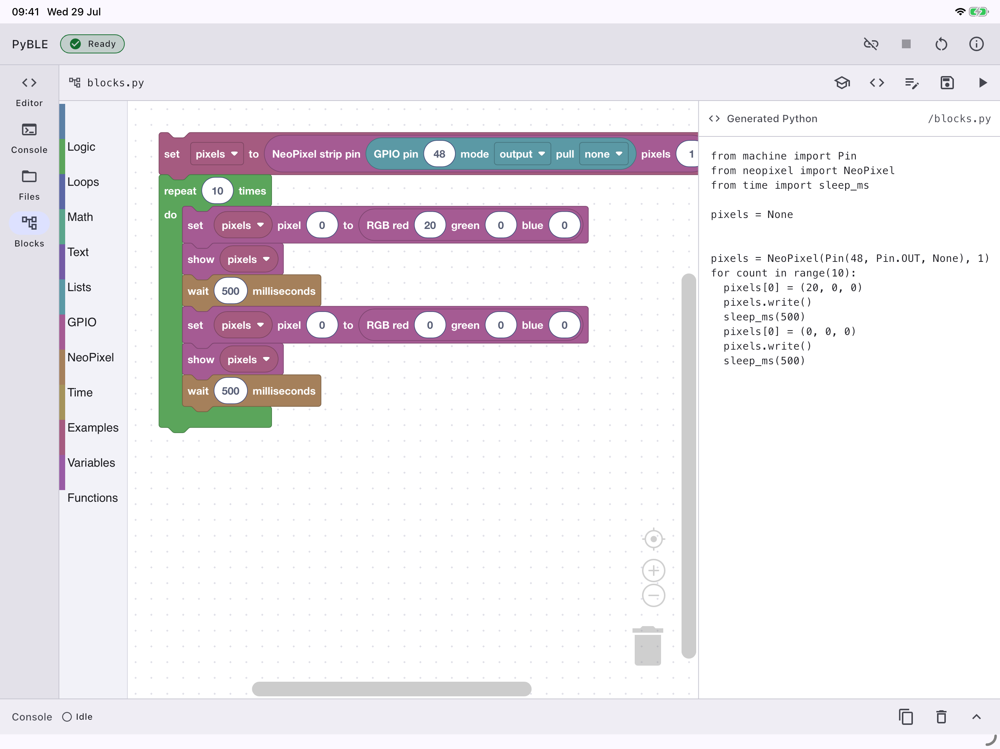

# PyBLE

**Python over Bluetooth Low Energy** — an open-source, tablet-first
MicroPython IDE.

[](https://github.com/PyBLE-dev/PyBLE/actions/workflows/ci.yml)
[](LICENSE)
[](#app)
[](docs/specifications/protocol.md)
[](https://pyble.dev/flash)

PyBLE lets you edit, transfer, run, and stop MicroPython programs on a
compatible microcontroller board over Bluetooth Low Energy. Its normal
workflow needs no USB serial connection, Wi-Fi onboarding, cloud account, or
telemetry.

- Qualified firmware v0.6.0: [installer and download](https://pyble.dev/flash)
- iPad external beta:
  [join with TestFlight](https://testflight.apple.com/join/yU4e8s6d)
- Android invited testing: [see the app page](https://pyble.dev/app)
- License: [MIT](LICENSE)

<p align="center">
  
</p>

<p align="center">
  <em>Actual PyBLE app in landscape: GPIO 48 NeoPixel Blocks beside the generated MicroPython.</em>
</p>

## What works

### App

The Flutter app currently provides:

- filtered BLE discovery and PBLE/1 connection;
- connected-board details with the PBLE/1 board ID and PyBLE agent firmware
  version retained in the always-visible connection status;
- a Python-highlighted MicroPython editor with always-visible, one-based line
  numbers, an adjustable 10–24 point code font, save, run, stop, soft reboot,
  and live console;
- wireless file browsing and transfer with integrity checks;
- an optional public GitHub example browser that resolves a repository/ref to
  an immutable commit, previews exact `.py` source-to-board paths, and imports
  selected files into the connected Files folder only after explicit review;
- an offline Blockly workspace with GPIO and standard MicroPython NeoPixel
  blocks, including explicit numeric GPIOs and bounded named `machine.Pin`
  identities;
- editable beginner examples;
- exact Blockly sidecar reopening and a bounded Python-to-blocks importer;
- an adaptive tablet interface for portrait and landscape use; and
- core editing, BLE, Files, Blocks, and Run operation without an account,
  analytics, or cloud dependency. GitHub is the sole optional network surface;
  its public, unauthenticated requests start only when the user opens the
  importer.

GitHub import is deliberately bounded and non-executing. It accepts a canonical
public repository URL, lazily browses one SHA-pinned snapshot, and selects only
ordinary lowercase `.py` files from one folder. Before any board write, PyBLE
fetches and validates the complete batch, shows the exact destination paths,
and asks separately before overwriting existing files. Import never creates a
remote folder hierarchy, opens an editor document, or runs downloaded code.

The iPad build is available through public TestFlight. An invited Android
internal test is available through Google Play; this is not a public Play
release. Both platforms share the same Flutter source and app test gates.

### Firmware

The board-side agent is built with upstream MicroPython and exposes PBLE/1 as a
BLE GATT peripheral. It supports:

- capability and device-information negotiation;
- run, stop, console, and soft-reboot control;
- filesystem operations with CRC validation and atomic uploads;
- resumable transfer behavior and bounded transport recovery;
- optional `main.py` auto-run protection;
- board naming and identify support; and
- upstream MicroPython’s standard `neopixel` module.

The installer offers the qualified public v0.6.0 release across all five exact
release profiles. All five exact-byte HIL rows passed. The four ESP profiles
use Web Serial from a supported desktop Chromium browser; Pico 2 W uses a
browser-verified UF2 download followed by a manual BOOTSEL copy.

| Profile                       | Exact hardware constraint                                               | Provisioning                       | Public status    |
| ----------------------------- | ----------------------------------------------------------------------- | ---------------------------------- | ---------------- |
| `esp32-4mb`                   | Classic ESP32; exactly 4 MiB external flash; no PSRAM required          | ESP Web Serial                     | Qualified v0.6.0 |
| `esp32-s3-n16r8`              | Lean ESP32-S3; exactly 16 MiB flash and 8 MiB Octal PSRAM               | ESP Web Serial                     | Qualified v0.6.0 |
| `waveshare-esp32-s3-lcd-147b` | Exact ESP32-S3-LCD-1.47B B-version; 16 MiB flash and 8 MiB Octal PSRAM  | ESP Web Serial                     | Qualified v0.6.0 |
| `esp32-c3-4mb`                | ESP32-C3 revision v0.3 or newer; exactly 4 MiB flash; no PSRAM required | ESP Web Serial                     | Qualified v0.6.0 |
| `rpi-pico2-w`                 | Raspberry Pi Pico 2 W; RP2350 with CYW43439                             | Verified UF2 + manual BOOTSEL copy | Qualified v0.6.0 |

The immutable
[release descriptor](https://pyble.dev/firmware/v0.6.0/release.json), with
SHA-256
`c2940281a14feddb55c48de15ac18087e9317d1b7130e514fab5a209b046a1e6`,
binds the five artifacts and passed HIL status to source commit
`0c7230d6708797c241160ba71fbd37e6b22f180a` and the annotated
[`firmware-v0.6.0` source tag](https://github.com/PyBLE-dev/PyBLE/tree/firmware-v0.6.0).
See the [release notes](https://pyble.dev/firmware/v0.6.0/RELEASE_NOTES.md),
[artifact checksums](https://pyble.dev/firmware/v0.6.0/SHA256SUMS), and
[recovery guide](https://pyble.dev/firmware/v0.6.0/RECOVERY.md) before
installing.

These maintained release profiles are not an app-side chip or board allowlist.
A future board is compatible when it has a maintained PyBLE agent port, BLE
GATT peripheral support, adequate resources, PBLE/1 conformance, recovery
testing, and hardware-validation evidence. Stock MicroPython plus generic
Bluetooth hardware is not sufficient by itself.

## How it fits together

```text
┌─────────────────────────┐       PBLE/1 over BLE       ┌─────────────────────────┐
│ PyBLE Flutter app       │ ◀─────────────────────────▶ │ Compatible board        │
│ iPadOS / Android        │  run · files · console      │ MicroPython + agent     │
└─────────────────────────┘                             └─────────────────────────┘
```

This repository is intentionally a monorepo:

- [`app/`](app/) — the Flutter tablet application;
- [`firmware/`](firmware/) — the portable agent, board overlays, and release
  tooling;
- [`examples/`](examples/) — clean-room, board-neutral MicroPython examples,
  including the public GitHub-import fixtures;
- [`docs/specifications/protocol.md`](docs/specifications/protocol.md) — the
  open PBLE/1 wire contract;
- [`tests/`](tests/) — host, conformance, release, and HIL test runners;
- [`tools/`](tools/) — repository gates and the `pyble.dev` website; and
- [`docs/`](docs/) — public specifications, decisions, roadmap, and validation
  evidence.

Keeping these parts together lets a protocol change update the app, firmware,
shared conformance corpus, documentation, and CI atomically.

## Try PyBLE

1. Install the iPad beta from
   [TestFlight](https://testflight.apple.com/join/yU4e8s6d), or build the
   Flutter app locally.
2. Open [pyble.dev/flash](https://pyble.dev/flash) in a supported desktop
   Chromium browser. Confirm that the qualified v0.6.0 release is selected,
   then choose only the exact profile matching the board and memory topology.
3. Before provisioning, back up the board and accept every safety
   acknowledgement. Flashing erases the board and its existing workspace.
4. For the four ESP profiles, connect the board and install with Web Serial.
   For Pico 2 W, download the verified UF2 and copy it manually to the BOOTSEL
   mass-storage volume. iPadOS cannot perform either wired provisioning step.
5. Open PyBLE, scan for the provisioned board, and connect over BLE.
6. To try the optional public example importer, open the destination folder in
   **Files**, choose **Import examples from GitHub**, enter
   `https://github.com/PyBLE-dev/PyBLE` with ref `main`, then browse to
   `examples/github-import`.
7. Select `hello.py` or `count.py`, review the displayed commit SHA and exact
   board target, and confirm any overwrite separately. Import does not open or
   run the file; open it from Files and choose Run only when you are ready.

See [support and troubleshooting](https://pyble.dev/support) for browser,
Bluetooth, network, and recovery requirements. A GitHub account or token is not
needed for the optional import; every other workflow remains available without
it.

## Build and test

Clone with both pinned upstream dependencies:

```sh
git clone --recurse-submodules https://github.com/PyBLE-dev/PyBLE.git
cd PyBLE
```

App:

```sh
cd app
flutter pub get --enforce-lockfile
flutter gen-l10n
dart format --output=none --set-exit-if-changed lib test integration_test
flutter analyze
flutter test --exclude-tags golden
# Run the pixel-golden lane on its pinned macOS host:
flutter test --tags golden
```

Firmware host tests:

```sh
tests/firmware_tests/run_tests.sh
```

Firmware build preparation and target builds:

```sh
firmware/scripts/install_esp_idf.sh
firmware/scripts/build.sh esp32
firmware/scripts/build.sh esp32-s3
firmware/scripts/build.sh waveshare-esp32-s3-lcd-147b
firmware/scripts/build.sh esp32-c3
firmware/scripts/install_arm_toolchain.sh
firmware/scripts/build_rp2.sh rpi-pico2-w
```

These are the five target builds in the qualified v0.6.0 release. The four ESP
targets produce Web Serial artifacts; `rpi-pico2-w` produces the UF2 used by
the verified-download and BOOTSEL flow.

The commands above build the current checkout. To start from the exact source
used for the public v0.6.0 artifacts, detach at the annotated release tag and
restore its pinned submodules:

```sh
git switch --detach firmware-v0.6.0
git submodule update --init --recursive
```

Website:

```sh
cd tools/web
npm ci
npm run check
```

The website gate includes a high/critical npm advisory audit, deterministic
third-party notices, and timeout-bounded regression coverage for the image
parser bundled inside the pinned preview adapter. Production remains a checked
static export with no Node.js website process.

The complete build requires the pinned toolchains documented in the relevant
component README and specifications.

Firmware binaries are external release artifacts, not committed source. The
production website receives a qualified bundle and validates its descriptor
and hashes before enabling installation. A source-only website build remains
fail-closed unless an explicit validated release input is supplied.

## Documentation

- [Documentation index](docs/README.md)
- [Changelog](CHANGELOG.md)
- [Qualified firmware v0.6.0 source](https://github.com/PyBLE-dev/PyBLE/tree/firmware-v0.6.0)
- [Qualified firmware v0.6.0 release notes](https://pyble.dev/firmware/v0.6.0/RELEASE_NOTES.md)
- [Product specification](docs/specifications/product.md)
- [Architecture](docs/specifications/architecture.md)
- [PBLE/1 protocol](docs/specifications/protocol.md)
- [Firmware contract](docs/specifications/firmware.md)
- [App contract](docs/specifications/app.md)
- [Hardware and compatibility](docs/specifications/hardware.md)
- [Public roadmap](docs/ROADMAP.md)
- [Architecture decisions](docs/decisions/README.md)
- [Validation evidence index](docs/validation/README.md)
- [Security policy](SECURITY.md)

## Citation

If you use PyBLE in research, teaching, or another published work, use the
metadata in [CITATION.cff](CITATION.cff). The app and firmware are versioned
independently, so cite the exact archived project snapshot or component
release you used; qualified firmware v0.6.0 is not the app version.

The first whole-project citation snapshot is
[2026.08.23](https://github.com/PyBLE-dev/PyBLE/releases/tag/source-2026.08.23).
It contains app source `0.1.0+4` and records qualified firmware `0.6.0` as a
separate component release.

## Contributing

Contributions are welcome, especially new validated board ports, protocol and
transport tests, accessibility improvements, translations, and beginner
examples. Read [CONTRIBUTING.md](CONTRIBUTING.md) and
[AGENTS.md](AGENTS.md) before opening a pull request.

Every commit must carry a DCO sign-off. PyBLE uses a clean-room boundary and CI
gates for prohibited identifiers, SPDX headers, dependency boundaries,
localization parity, submodule pins, app tests, website checks, and firmware
builds.

PyBLE is an independent [MIT-licensed](LICENSE) SciLabPro open-source project.
